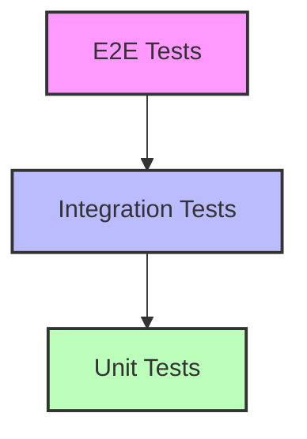

# Vitest 実践ガイド

## 目次
1. [テスト戦略](#テスト戦略)
2. [CI/CD統合](#cicd統合)
3. [品質管理](#品質管理)
4. [チーム開発](#チーム開発)

## テスト戦略

### 1. テストピラミッド



### 2. テストの優先順位付け

```typescript
// vitest.config.ts
export default defineConfig({
  test: {
    include: [
      // 重要なテストを先に実行
      'src/**/__tests__/**/*.test.ts',
      // その他のテスト
      'src/**/*.test.ts',
    ],
  },
})
```

### 3. テストカバレッジの目標設定

```typescript
// vitest.config.ts
export default defineConfig({
  test: {
    coverage: {
      thresholds: {
        branches: 80,
        functions: 80,
        lines: 80,
        statements: 80,
      },
    },
  },
})
```

## CI/CD統合

### 1. GitHub Actions設定

```yaml
# .github/workflows/test.yml
name: Test

on:
  push:
    branches: [ main ]
  pull_request:
    branches: [ main ]

jobs:
  test:
    runs-on: ubuntu-latest
    steps:
      - uses: actions/checkout@v3
      - uses: actions/setup-node@v3
        with:
          node-version: '18'
      - run: npm ci
      - run: npm run test
      - run: npm run test:coverage
```

### 2. テストレポートの生成

```yaml
# .github/workflows/test.yml
      - name: Upload coverage reports
        uses: codecov/codecov-action@v3
        with:
          token: ${{ secrets.CODECOV_TOKEN }}
```

### 3. プルリクエストチェック

```yaml
# .github/workflows/pr-check.yml
name: PR Check

on:
  pull_request:
    branches: [ main ]

jobs:
  check:
    runs-on: ubuntu-latest
    steps:
      - uses: actions/checkout@v3
      - uses: actions/setup-node@v3
        with:
          node-version: '18'
      - run: npm ci
      - run: npm run test
      - run: npm run test:coverage
```

## 品質管理

### 1. コード品質チェック

```json
// package.json
{
  "scripts": {
    "lint": "eslint . --ext .ts,.tsx",
    "type-check": "tsc --noEmit",
    "test": "vitest",
    "test:coverage": "vitest run --coverage",
    "quality": "npm run lint && npm run type-check && npm run test:coverage"
  }
}
```

### 2. テスト品質の監視

```typescript
// test-utils/quality-check.ts
export function checkTestQuality(testFile: string) {
  const stats = {
    totalTests: 0,
    assertions: 0,
    coverage: 0,
  }

  // テストファイルの解析
  // カバレッジレポートの解析
  // 品質メトリクスの計算

  return stats
}
```

### 3. パフォーマンスモニタリング

```typescript
// test-utils/performance.ts
export function measureTestPerformance(testFn: () => Promise<void>) {
  const start = performance.now()
  return testFn().then(() => {
    const duration = performance.now() - start
    return {
      duration,
      timestamp: new Date().toISOString(),
    }
  })
}
```

## チーム開発

### 1. テスト規約

```markdown
# テスト規約

## 命名規則
- テストファイル: `*.test.ts` または `*.spec.ts`
- テストスイート: テスト対象の機能を説明する名前
- テストケース: 期待する動作を説明する名前

## 構造
- テストの準備（Arrange）
- テストの実行（Act）
- 結果の検証（Assert）

## カバレッジ
- 最低80%のカバレッジを維持
- 重要なビジネスロジックは100%カバレッジ
```

### 2. コードレビュー

```markdown
# テストレビューチェックリスト

## テストの品質
- [ ] テストの目的が明確か
- [ ] エッジケースが考慮されているか
- [ ] モックが適切に使用されているか

## コードの品質
- [ ] テストが読みやすいか
- [ ] 重複が排除されているか
- [ ] 適切なアサーションが使用されているか

## メンテナンス性
- [ ] テストデータが適切に管理されているか
- [ ] テストの依存関係が最小限か
- [ ] テストの実行が高速か
```

### 3. ドキュメント

```markdown
# テストドキュメント

## テストの実行方法
```bash
# すべてのテストを実行
npm run test

# カバレッジレポートを生成
npm run test:coverage

# 特定のテストを実行
npm run test -- path/to/test.test.ts
```

## テストの追加方法
1. テストファイルの作成
2. テストケースの実装
3. テストの実行と検証
4. カバレッジの確認

## トラブルシューティング
- テストが失敗する場合の対処方法
- カバレッジが低い場合の改善方法
- パフォーマンスの問題への対処
```

## ベストプラクティス

### 1. テストの設計

- テストの独立性を保つ
- テストの実行順序に依存しない
- テストデータを適切に管理する

### 2. メンテナンス

- 定期的なテストの見直し
- 不要なテストの削除
- テストの最適化

### 3. チーム協業

- コードレビューの活用
- 知識の共有
- 継続的な改善 